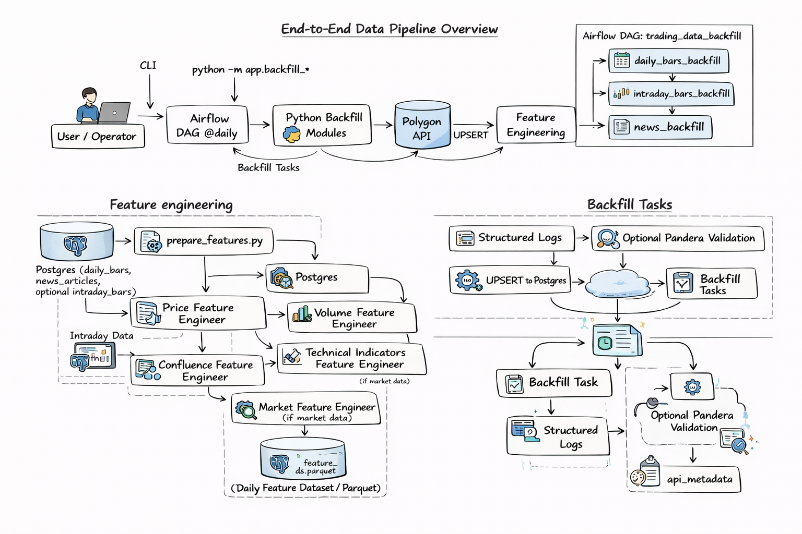

# 📈 End-to-End Trading Data & Machine Learning Pipeline

**Author:** Giang Tran

[](https://python-sql.streamlit.app/)

A production-grade, batch-first data pipeline designed to ingest, normalize, and transform high-frequency market data into mathematically rigorous, ML-ready features for quantitative trading research.

**Business Objective:** This project bridges the gap between raw data and actionable statistical models. By automatically handling API ingestion, quality gates, and data storage, it provides quantitative analysts and portfolio managers with a clean, highly reliable feature store to identify hidden market behaviors and clustering correlations.



## 🏗️ System Architecture (Medallion Concept)

This pipeline implements a modified Medallion architecture orchestrated by **Apache Airflow**, entirely containerized via **Docker**.

- **Bronze (Ingestion):** Raw daily/intraday OHLCV bars and news sentiment JSONs fetched directly from the Polygon.io API.
- **Silver (Normalization):** Cleansed and standardized tables stored in **PostgreSQL** (`daily_bars`, `intraday_bars`, `news_articles`). Includes automated metadata tracking (`api_metadata`) for run observability.
- **Gold (Feature Engineering & ML):** Mathematically transformed feature sets generated in `ml/` (e.g., rolling volatility, momentum indicators) used directly for unsupervised clustering models and visualization via **Streamlit**.

### Data Complexity Showcase
*Handling complex, nested API structures into structured relational tables.*
```json
// Example: Raw Polygon.io Ingestion payload handled by the pipeline
{
  "ticker": "AAPL",
  "queryCount": 1,
  "results": [
    {
      "v": 52693892,
      "vw": 174.56,
      "o": 173.9,
      "c": 175.1,
      "h": 175.42,
      "l": 173.12,
      "t": 1698667200000,
      "n": 567891
    }
  ]
}
```

## 🚀 Core Capabilities
1. Data Engineering & Orchestration
Automated Batching: Airflow DAGs (airflow/dags/) schedule backfill_daily, backfill_intraday, and backfill_news.

Fault Tolerance: Ingestion state and failure statuses are recorded in api_metadata for seamless resume support.

Optional Quality Gates: Toggleable Pandera-based schema and invariant checks (ENABLE_DATA_QUALITY_CHECKS=1) to fail fast on corrupted data.

2. Statistical Modeling & Analytics
Feature Store Creation: Dedicated ml/scripts generate advanced statistical features required for financial modeling.

Unsupervised Learning: Includes a clustering model (Model 1) to group assets by actual risk-return behaviors rather than traditional sector labels.

Interactive Dashboards: Live Streamlit app (streamlit/clustering_app.py) for visual data exploration.

## ⚡ Quick Start
Prerequisites
Python 3.9+ | Docker & Docker Compose | PostgreSQL | Polygon.io API key

## One-Minute Demo (Local Infrastructure)

```bash
# 1) Start Postgres and Airflow services
make up

# 2) Follow Airflow execution logs
make logs

# 3) Trigger a local backfill
make backfill-daily

# 4) Launch the ML clustering dashboard
streamlit run streamlit/clustering_app.py
```

## Project Structure

```
trading-pipeline/
├── app/                    # Application code
│   ├── backfill/          # Data backfill modules
│   ├── config.py          # Configuration management
│   └── polygon_trading_client.py  # API client
├── ml/                     # Machine learning code
│   ├── features/          # Feature engineering modules
│   ├── models/            # ML model definitions and training
│   ├── scripts/           # Feature preparation scripts
│   └── notebooks/         # Jupyter notebooks
├── airflow/               # Airflow DAGs
│   └── dags/             # Scheduled tasks
├── db/                    # Database scripts
│   ├── 00_init.sql       # Database initialization
│   └── 01_create_tables.sql  # Table definitions
├── docs/                  # Documentation
│   ├── ARCHITECTURE.md    # System design + decisions
│   ├── RUNBOOK.md         # Ops / troubleshooting / manual backfills
│   ├── PIPELINE_DIAGRAM.md # Mermaid diagrams
│   ├── FEATURES.md        # Feature catalog
│   └── ML.md              # Modeling status + how to run clustering
├── tests/                 # Test files
└── docker-compose.yml     # Infrastructure setup
```

## Documentation

### Essential Reading
- **[Architecture](./docs/ARCHITECTURE.md)**: System design, data flow, and production-ready decisions
- **[Pipeline Diagram](./docs/PIPELINE_DIAGRAM.md)**: Detailed DAG and data model diagrams (Mermaid)
- **[Feature Catalog](./docs/FEATURES.md)**: Feature definitions, statistical metrics, and modeling notes
- **[ML / Modeling](./docs/ML.md)**: Current model status and clustering methodology
- **[Runbook](./docs/RUNBOOK.md)**: Ops, troubleshooting, and manual backfills

### Project Planning
- **[Project Thinking](./PROJECT_THINKING.md)**: Early design notes (optional reading)

## Usage Examples

### Generating Statistical Features

```python
from ml.scripts.prepare_features import prepare_daily_features

# Generate rolling daily features for quantitative analysis
features = prepare_daily_features(
    ticker="AAPL",
    save_path="data/daily_features.parquet"
)
```

### Data Quality Check

```python
from ml.scripts.prepare_features import _load_daily_bars, _load_intraday_bars
from app.config import connect_db

conn = connect_db(use_docker=False)
daily_bars, daily_gaps = _load_daily_bars(conn, "AAPL")
intraday_bars, intraday_gaps = _load_intraday_bars(conn, "AAPL", time_config)

# Check for gaps
if not intraday_gaps.empty:
    print(f"Found {len(intraday_gaps)} gaps")
    print(intraday_gaps[['missing_timestamps', 'missing_count']])
```

### Notebook Workflow

See `ml/notebooks/full_feature_pipeline.ipynb` for an interactive feature engineering workflow.

## Quick Reference

### Common Commands

```bash
# Backfill data (market indices like SPY are included automatically)
python -m app.backfill_daily --mode resume
python -m app.backfill_intraday --mode resume --tickers AAPL MSFT
python -m app.backfill_news --mode full --start-date 2024-01-01

# Generate features
python -m ml.scripts.prepare_features --model daily --ticker AAPL --save data/features.parquet
python -m ml.scripts.prepare_features --model intraday --ticker AAPL

# Start services
docker compose up -d
docker compose logs -f airflow-webserver airflow-scheduler

# Run tests
pytest tests/ -v
```

### Common Issues

| Issue | Solution |
|-------|----------|
| `ImportError: cannot import name 'X' from 'ml.features'` | Check `ml/features/__init__.py` - ensure all classes are exported |
| `ValueError: mutable default for field` | Use `field(default_factory=...)` instead of mutable defaults in dataclasses |
| `NameError: name '__file__' is not defined` | Use try/except block or `Path.cwd()` fallback in notebooks |
| Database connection fails with `local` hostname | Use `localhost` or actual IP address in `.env` file |
| Gap detection shows false positives for holidays | Manually filter known holidays (see list above) |

### Key File Locations

- **Feature Engineering**: `ml/scripts/prepare_features.py`
- **Gap Detection**: `ml/scripts/prepare_features.py::_warn_if_timestamp_gaps()`
- **Feature Classes**: `ml/features/`
- **Notebooks**: `ml/notebooks/full_feature_pipeline.ipynb`
- **Database Schema**: `db/01_create_tables.sql`
- **API Client**: `app/polygon_trading_client.py`

## Known Issues and Limitations

### Data Quality
- **Holiday Gaps**: 4-day gaps (Friday to Tuesday) are often market holidays, not data issues (see list above).
- **Missing Data**: Gap detection identifies missing timestamps, but automatic backfill is not yet implemented.

### Technical Debt
- Holiday calendar integration for gap detection (planned)
- Automatic backfill mechanism for missing data (planned)

For ops/troubleshooting, see the [Runbook](./docs/RUNBOOK.md).

## Development

### Running Tests
```bash
pytest tests/
```

### Code Style
```bash
ruff check app tests
```

### Adding New Features
1. Create feature branch
2. Implement feature with tests
3. Update documentation
4. Submit pull request

## Contributing

1. Use feature branches + PRs (even if solo, it demonstrates professional workflow)
2. Update documentation when behavior changes (`docs/ARCHITECTURE.md`, `docs/RUNBOOK.md`, `docs/ML.md`)
3. Add/adjust tests for new behavior (`pytest`)
4. Keep CI green (ruff + pytest)

## Support

For issues and questions:
- Start with the [Runbook](./docs/RUNBOOK.md) (common failure modes + fixes)
- Review [Architecture](./docs/ARCHITECTURE.md) for system context
- Open an issue on GitHub

Looking for the mathematical deep-dive on how these features are used? Check out my [Stock Clustering & Risk Intelligence Engine ([python-sql repo](https://github.com/giangphuongtran/python-sql)) which applies PCA and K-Means to this data.
