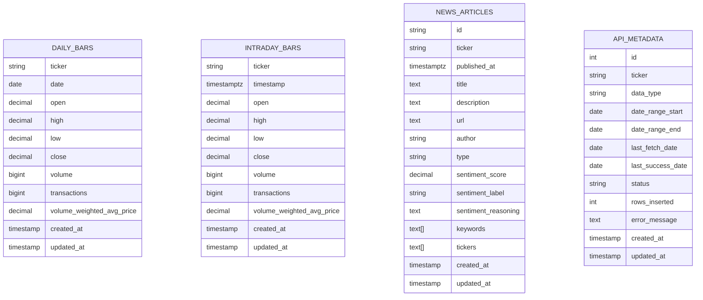

## Trading Pipeline – Detailed Diagrams (Mermaid)

How to view:
- GitHub renders Mermaid diagrams automatically in markdown.
- If your viewer doesn’t, paste these blocks into the Mermaid Live Editor (`https://mermaid.live`).

### 1) System / Infrastructure (runtime view)

```mermaid
flowchart LR
  dev[Developer / Operator] -->|make up / Airflow UI / CLI| airflow

  subgraph docker[Docker Compose Network]
    airflow[Airflow\n(webserver + scheduler)]:::svc
    pg[(Postgres 15\ntrading_data)]:::db
    logs[(Airflow logs volume)]:::store
  end

  polygon[(Polygon.io API)]:::ext

  airflow -->|runs DAG tasks| task[Backfill task subprocess\npython -m app.backfill_*]:::svc
  task -->|REST calls| polygon
  task -->|UPSERT| pg
  task -->|write status/rows| pg
  airflow --> logs

  classDef svc fill:#d7ecff,stroke:#1e6aa8,stroke-width:1px;
  classDef db fill:#e8ffe8,stroke:#2b7a2b,stroke-width:1px;
  classDef ext fill:#fff1d6,stroke:#b7791f,stroke-width:1px;
  classDef store fill:#f2f2f2,stroke:#666,stroke-width:1px;
```

### 2) Orchestration (Airflow DAG-level)

```mermaid
flowchart TB
  subgraph DAG[Airflow DAG: trading_data_backfill (@daily)]
    daily[task: backfill_daily_bars] --> intraday[task: backfill_intraday_bars] --> news[task: backfill_news_articles]
  end

  daily -->|python -m app.backfill_daily| daily_mod[app.backfill_daily]:::py
  intraday -->|python -m app.backfill_intraday| intra_mod[app.backfill_intraday]:::py
  news -->|python -m app.backfill_news| news_mod[app.backfill_news]:::py

  classDef py fill:#efe9ff,stroke:#5a3ea6,stroke-width:1px;
```

### 3) Backfill module – detailed execution flow (per task)

```mermaid
flowchart TD
  start([Task starts]) --> args[Parse args\n(mode, dates, tickers)]
  args --> conn[connect_db()\nDATABASE_URL_HOST / DOCKER]
  conn --> plan[compute_backfill_plan()\n(resume/full + chunking)]
  plan --> loop{for each ticker/date chunk}
  loop --> api[PolygonTradingClient\nget_*()]
  api --> dq{ENABLE_DATA_QUALITY_CHECKS?}
  dq -->|no| upsert[UPSERT into Postgres table]
  dq -->|yes| validate[Pandera validation\nschema + invariants]:::dq
  validate --> upsert
  upsert --> meta[update_metadata()\napi_metadata rows/status]
  meta --> loop
  loop --> done([Task done])

  validate -->|fails| fail[Raise DataQualityError]:::bad
  fail --> meta_fail[update_metadata(status=failed)]:::bad
  meta_fail --> done

  classDef dq fill:#fff5f5,stroke:#c53030,stroke-width:1px;
  classDef bad fill:#ffe0e0,stroke:#c53030,stroke-width:2px;
```

### 4) Storage / Data model (Postgres tables)



### 5) Quality + CI “gates” (what prevents silent failure)

```mermaid
flowchart LR
  commit[Commit / PR] --> ci[GitHub Actions CI\nruff + pytest]:::gate
  ci -->|merge| main[main branch]
  main --> deploy[Deploy / run in prod]:::svc
  deploy --> airflow[Airflow schedule]:::svc
  airflow --> dq[Quality gates\n(Pandera optional)]:::gate
  dq --> db[(Postgres tables)]:::db

  classDef gate fill:#e6fffa,stroke:#2c7a7b,stroke-width:1px;
  classDef svc fill:#d7ecff,stroke:#1e6aa8,stroke-width:1px;
  classDef db fill:#e8ffe8,stroke:#2b7a2b,stroke-width:1px;
```


